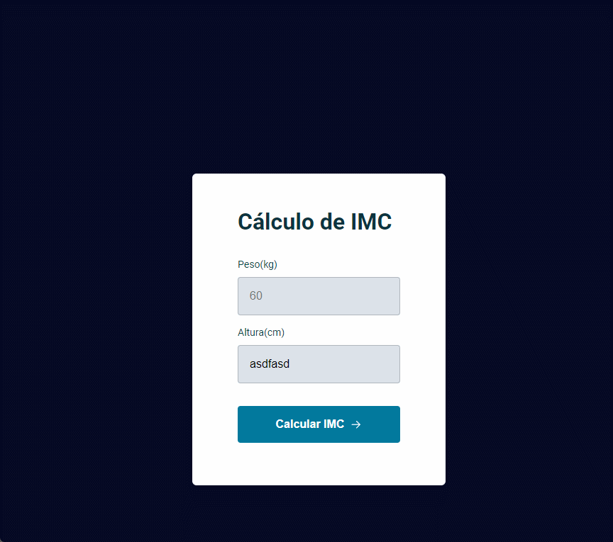

 
  

## Calculadora de IMC
- Bem-vindo ao repositório da Calculadora de IMC! Esta é uma aplicação web simples e interativa para calcular o Índice de Massa Corporal (IMC) e fornecer uma interpretação do resultado com base em categorias de IMC estabelecidas.

## 🚀 Funcionalidades
- Cálculo do IMC: Insira seu peso e altura para calcular seu IMC.

- Categorias de IMC: O resultado do IMC é interpretado de acordo com 
categorias como Abaixo do Peso, Peso Normal, Sobrepeso e Obesidade.

- Design Responsivo: A aplicação é responsiva e funciona bem em dispositivos móveis e desktops.

- Interface Simples e Intuitiva: Focada em uma experiência de usuário clara e direta.

## 💻 Tecnologias Utilizadas
- HTML5: Estrutura da página web.
- CSS3: Estilização da interface.
- JavaScript: Lógica de cálculo e interação com o usuário.
- Vercel para a hospedagem

## 🧩 Como Usar
- Acesse a página: Navegue até Calculadora de IMC.
- Preencha seus dados: Insira seu peso (em kg) e altura (em cm).
- Calcule seu IMC: Clique no botão para calcular.
- Veja o resultado: A aplicação exibirá o valor do IMC e a categoria correspondente.

## 🤝 Contribuições
Contribuições são bem-vindas! Se você quiser melhorar a calculadora ou adicionar novas funcionalidades, sinta-se à vontade para abrir um Pull Request.

## 📧 Contato
Para quaisquer dúvidas ou sugestões, você pode me contatar através do e-mail: matheusibnf@hotmail.com

<strong>Link do deploy do projeto: <strong/> https://calculadora-de-imc-black-two.vercel.app
